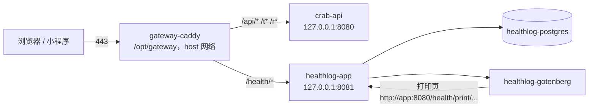

# 部署说明

healthlog 和 crab（大闸蟹订单）部署在同一台腾讯云轻量服务器上（2 核 4 GB，Ubuntu 24.04），
共用一个域名，healthlog 在 `https://<域名>/health/`。

- **第一次上线**：按 [SERVER_STEPS.md](SERVER_STEPS.md) 逐步操作（含网关的完整配置和回滚方式）。
- 本文是参考：架构、借鉴 crab 的坑、日常运维、备份。

## 架构



**两个项目互不依赖。**唯一共享的是 80/443 和域名，它们归一个独立的网关 `/opt/gateway`（一个 Caddy + 一个 Caddyfile），
不属于任何一个项目的仓库。每个应用只把端口绑在 `127.0.0.1` 上；网关用 host 网络直接转发，不加入任何应用的 Docker 网络。
新增或调整路由只改网关的 Caddyfile。

| 路径（同一域名） | 转发到 |
|---|---|
| `/api/*`、`/t*`、`/r*` | crab（接口、买家查单页、买家登记页） |
| `/health` | 308 跳到 `/health/` |
| `/health/*` | healthlog（页面、`/health/api/...`、`/health/healthz`） |
| 其余 | 404 |

healthlog 自身挂在前缀下（`BASE_PATH=/health`）：网关原样转发路径；应用返回的附件和头像 URL、Cookie 的 Path、
前端的资源地址和路由都带 `/health`。本地开发 `BASE_PATH` 留空，从根路径访问。

| healthlog 容器 | 端口 | 说明 |
|---|---|---|
| healthlog-app | 127.0.0.1:8081 | 应用 + 前端 + 后台任务（语音转码、删文件） |
| healthlog-postgres | 不暴露 | 数据在 `/opt/healthlog/data/postgres`（绑定挂载） |
| healthlog-gotenberg | 不暴露 | 官方镜像，自带 `fonts-noto-cjk` |

## 从 crab 借鉴的坑

| 坑 | crab 的教训 | healthlog 的做法 |
|---|---|---|
| 443 上两套服务 | 两个反代同时监听 443，新连接随机落到没有证书的那个，Safari 报「无法建立安全连接」 | 只有网关一个进程监听 80/443，应用自己不带反代 |
| 路径冲突 | crab 占了 `/api/*`、`/t*`、`/r*`（`/t*` 是所有 t 开头的路径） | 全部挂在 `/health/` 下，路由规则集中在网关 |
| Cookie 串站 | 同域名下各应用的 Cookie 会互相带上 | Cookie 名 `hl_sid`，Path 限定为 `/health/`（crab 本身不用 Cookie） |
| HTTP/3 | 宣告 h3 后 Safari 走 UDP 443，云防火墙默认不放通，直接连不上 | 网关全局 `protocols h1 h2` |
| AAAA 记录 / 备案 | 未备案或多余的 AAAA 记录会让 HTTPS 出问题 | 沿用 crab 已备案的域名，不新增解析 |
| Docker Hub 拉不动 | 国内直连超时 | 机器已配腾讯云镜像源；Go 用 goproxy.cn，npm 用 npmmirror，apk 用 mirrors.tencent.com（`.env` 可改） |
| 数据目录权限 | 容器内非 root（uid 10001），宿主目录不归它就写不进 | `data/storage` 交给 10001（`sudo make docker-init`） |
| `down -v` 删数据 | 删卷后数据全没 | PostgreSQL 用绑定挂载 `./data/postgres`；网关证书在卷里，网关目录别 `down -v` |
| `.env` 改了不生效 | `docker compose restart` 不重读 `.env` | 改完一律 `docker compose up -d`；改 `BASE_PATH` 要重新构建，走 `deploy.sh` |
| `.env` 行尾注释 | 朴素解析器会把注释当成值 | `.env.example` 注释都单独成行 |
| 快照当备份 | 磁盘快照可能截到写一半的数据库 | `scripts/backup.sh` 每天 `pg_dump` + 附件镜像，可加密、可同步到 COS |
| 自动部署 | 个人项目不值得给 CI 开一个直连生产的口子 | CI 只跑测试；发布在服务器上执行 `./scripts/deploy.sh`（备份 → 快进拉取 → 构建 → 替换 → 自检 → 失败回滚） |
| 限流拿不到真实 IP | 反代不传 X-Forwarded-For 时所有人共用一个限流桶 | 网关默认设置 X-Forwarded-For，healthlog 和 crab 都取第一跳 |

## 日常

| 操作 | 命令（在 `/opt/healthlog`） |
|---|---|
| 发布新版本 | `./scripts/deploy.sh`（或本地 `ssh <服务器> 'cd /opt/healthlog && ./scripts/deploy.sh'`） |
| 只改了 `.env`（`BASE_PATH` 除外） | `docker compose up -d` |
| 看日志 | `docker compose logs -f app`（JSON，不含记录正文） |
| 改密码 | `docker compose exec app healthlog user passwd --username <用户名>`（会注销全部会话） |
| 手动备份 | `./scripts/backup.sh` |
| 紧急回滚镜像 | `docker image tag healthlog:rollback healthlog:latest && docker compose up -d --force-recreate app` |
| 进数据库 | `docker compose exec postgres psql -U healthlog` |
| 改网关路由 | 编辑 `/opt/gateway/Caddyfile`，`docker exec gateway-caddy caddy reload --config /etc/caddy/Caddyfile` |

迁移只向前执行。回滚代码不会回滚表结构；需要时用 `backup/db/` 里部署前那份 dump 恢复：

```bash
docker compose stop app
docker compose exec -T postgres pg_restore -U healthlog -d healthlog --clean --if-exists < backup/db/healthlog-<时间>.dump
docker compose start app
```

## 备份

```cron
10 3 * * * /opt/healthlog/scripts/backup.sh >> /var/log/healthlog-backup.log 2>&1
```

- 数据库：`backup/db/healthlog-*.dump`，保留 `KEEP_DAYS` 天（默认 30）。
- 附件：`backup/storage/` 是 `data/storage/` 的镜像（附件只写一次，镜像天然增量）。
- 加密：`.env` 里填 `BACKUP_AGE_RECIPIENT`（`apt install age`，用 `age-keygen` 生成密钥，私钥别放这台机器上）。
- 异地：`.env` 里填 `BACKUP_REMOTE`（rclone 目标，如同地域 COS 内网域名，不占公网流量），附件建议用 rclone crypt 远端。
- 试用期第 2 周在另一台机器上用上面的 `pg_restore` 做一次完整恢复演练，确认记录和附件都能打开。

## 常见问题

**`/health/` 返回 502**：healthlog 没起来，`docker compose ps && docker compose logs --tail=50 app`。

**页面白屏、资源 404**：前端构建时的前缀和运行时 `BASE_PATH` 不一致。改过 `BASE_PATH` 后要重新构建：`./scripts/deploy.sh`。

**导出 PDF 报「生成 PDF 失败」**：`docker compose logs gotenberg`。打印页由 Gotenberg 通过 `http://app:8080/health/print/...` 打开，不走公网。

**证书、HTTPS 问题**：看 `docker logs gateway-caddy`。Safari 时好时坏的排查思路同 crab 的 `scripts/tls-check.sh`。

**内存**：粗估 PostgreSQL + Gotenberg（Chromium）+ 应用常驻不到 1 GB，加上 crab 仍在 4 GB 以内；用 `docker stats --no-stream` 看实际值。
