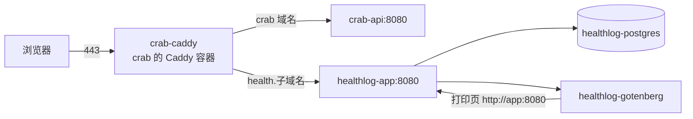

# 部署：与 crab 共用一台服务器

healthlog 部署在 crab（大闸蟹订单）已经在跑的那台腾讯云轻量服务器上（2 核 4 GB，Ubuntu 24.04）。
这份文档记录怎么装，以及从 crab 部署中学到、在这里已经规避掉的坑。

## 拓扑



| 容器 | 所属 compose | 端口 | 说明 |
|---|---|---|---|
| crab-caddy | /opt/crab-order | 80、443 | **唯一**对外的进程，两个项目的 HTTPS 都由它签发和终止 |
| crab-api | /opt/crab-order | 127.0.0.1:8080 | crab 后端 |
| healthlog-app | /opt/healthlog | 127.0.0.1:8081 | 同时加入 crab 的网络 `crab-order_default`，别名 `healthlog-app` |
| healthlog-postgres | /opt/healthlog | 不暴露 | 数据在 `/opt/healthlog/data/postgres`（绑定挂载） |
| healthlog-gotenberg | /opt/healthlog | 不暴露 | 官方镜像，自带 `fonts-noto-cjk` |

## 从 crab 借鉴的坑（都已处理）

| 坑 | crab 的教训 | healthlog 的做法 |
|---|---|---|
| 443 上两套服务 | 两个反代同时监听 443，新连接随机落到没有证书的那个，Safari 报「无法建立安全连接」，时好时坏 | 不起自己的 Caddy，在 crab 的 Caddy 里加一个站点（下面第 2 节） |
| 8080 端口 | crab-api 已占 `127.0.0.1:8080` | healthlog 用 `127.0.0.1:8081`，且只绑回环 |
| HTTP/3 | Caddy 宣告 h3 后 Safari 走 UDP 443，云防火墙默认不放通，直接连不上 | 复用 crab Caddyfile 全局的 `protocols h1 h2`，站点里不开 h3 |
| AAAA 记录 | 端口映射只绑 IPv4，AAAA 指向本机时 Safari 优先走 IPv6 失败 | 子域名只加 A 记录 |
| 域名备案 | 未备案域名解析到国内机器，443 握手被掐断 | 用 crab 已备案主域名的子域名（备案按主域名，子域名一般无需再备案），技术方案里的备案风险随之消除 |
| Docker Hub 拉不动 | 国内直连超时 | 机器已配 `mirror.ccs.tencentyun.com`；Go 用 goproxy.cn，npm 用 npmmirror，apk 用 mirrors.tencent.com（都是 build arg，`.env` 可改） |
| 数据目录权限 | 容器内非 root（uid 10001），宿主目录不归它就写不进 | `sudo make docker-init` 把 `data/storage` 交给 10001 |
| `down -v` 删数据 | 删卷后证书/数据全没 | PostgreSQL 用绑定挂载 `./data/postgres`，`down -v` 删不到；证书卷归 crab，别在 crab 目录执行 `down -v` |
| `.env` 改了不生效 | `docker compose restart` 不重读 `.env` | 改完一律 `docker compose up -d` |
| `.env` 行尾注释 | 朴素解析器会把注释当成值 | `.env.example` 注释都单独成行，填值时也别在行尾写注释 |
| 挂载的 Caddyfile 改了不生效 | 需要重载 | `deploy.sh` 写入站点文件后执行 `caddy reload` |
| 快照当备份 | 磁盘快照可能截到写一半的数据库 | `scripts/backup.sh` 每天 `pg_dump` + 附件镜像，可加密、可同步到 COS |
| 自动部署 | 个人项目不值得给 CI 开一个直连生产的口子 | CI 只跑测试；发布在服务器上执行 `./scripts/deploy.sh`（备份 → 快进拉取 → 构建 → 替换 → 自检 → 失败回滚） |
| 限流拿不到真实 IP | 反代不传 X-Forwarded-For 时所有人共用一个限流桶 | Caddy 默认会设置 X-Forwarded-For，应用用 chi RealIP 取真实 IP 做登录限流 |

## 1. 放代码与写配置

```bash
sudo mkdir -p /opt/healthlog && sudo chown "$USER" /opt/healthlog
git clone git@github.com:RexingRui/famliy-health.git /opt/healthlog   # 私有仓库用只读部署密钥，同 crab
cd /opt/healthlog
cp .env.example .env
sed -i "s|^POSTGRES_PASSWORD=.*|POSTGRES_PASSWORD=$(openssl rand -hex 24)|" .env
sed -i "s|^PRINT_TOKEN_SECRET=.*|PRINT_TOKEN_SECRET=$(openssl rand -hex 32)|" .env
vi .env     # 填 HEALTH_DOMAIN，例如 health.<crab 的主域名>
sudo make docker-init
```

DNS：在 DNSPod 给 `HEALTH_DOMAIN` 加一条 **A 记录**指向本机，**不要加 AAAA**。云防火墙不用改（仍是 80/443）。

## 2. 让 crab 的 Caddy 接入 healthlog（一次性）

crab 的 Caddyfile 只认它自己的域名，需要在 crab 仓库做一次小改动，让它加载一个共享的站点目录：

`/opt/crab-order/deploy/Caddyfile` 末尾加一行：

```caddy
import /etc/caddy/sites/*.caddy
```

`/opt/crab-order/docker-compose.yml` 的 `caddy` 服务 `volumes` 加一行：

```yaml
      - /opt/caddy-sites:/etc/caddy/sites:ro
```

然后：

```bash
sudo mkdir -p /opt/caddy-sites && sudo chown "$USER" /opt/caddy-sites
cd /opt/crab-order && docker compose --profile proxy up -d --force-recreate caddy
```

以后 healthlog 的站点文件由 `deploy.sh` 从 `deploy/caddy/healthlog.caddy` 渲染到 `/opt/caddy-sites/healthlog.caddy`
并执行 `docker exec crab-caddy caddy reload`，不需要再动 crab。crab 的全局配置（只开 h1/h2）同样作用于这个站点。

> crab 的 compose 项目名是 `crab-order`，所以它的网络叫 `crab-order_default`。如果名字不同，改 `.env` 里的 `EDGE_NETWORK`。

## 3. 首次启动

```bash
cd /opt/healthlog
./scripts/deploy.sh                    # 首次也走它：构建、启动、写 Caddy 站点、自检
docker compose exec app healthlog user create --username me    # 交互输入两次密码（至少 8 位）
```

`deploy.sh` 自检的是容器内的 `/healthz`（数据库和 Gotenberg 都通才算过）。Gotenberg 镜像约 1.5 GB，首次拉取较慢。
证书由 crab 的 Caddy 在第一次访问 `https://HEALTH_DOMAIN` 时自动申请，看 `docker logs crab-caddy`。

验证：

```bash
curl -s localhost:8081/healthz                         # 本机
curl -sI https://$HEALTH_DOMAIN/ | head -n1            # 公网：HTTP/2 200
curl -sI https://$HEALTH_DOMAIN/ | grep -i alt-svc     # 不应有 h3
```

## 4. 日常

| 操作 | 命令 |
|---|---|
| 发布新版本 | `./scripts/deploy.sh`（或本地 `ssh <服务器> 'cd /opt/healthlog && ./scripts/deploy.sh'`） |
| 只改了 `.env` | `docker compose up -d` |
| 看日志 | `docker compose logs -f app`（JSON，不含记录正文） |
| 改密码 | `docker compose exec app healthlog user passwd --username me`（会注销全部会话） |
| 手动备份 | `./scripts/backup.sh` |
| 紧急回滚镜像 | `docker image tag healthlog:rollback healthlog:latest && docker compose up -d --force-recreate app` |
| 进数据库 | `docker compose exec postgres psql -U healthlog` |

迁移只向前执行。回滚代码不会回滚表结构；需要时用 `backup/db/` 里部署前那份 dump 恢复：

```bash
docker compose stop app
docker compose exec -T postgres pg_restore -U healthlog -d healthlog --clean --if-exists < backup/db/healthlog-<时间>.dump
docker compose start app
```

## 5. 备份

```cron
0 3 * * * /opt/healthlog/scripts/backup.sh >> /var/log/healthlog-backup.log 2>&1
```

- 数据库：`backup/db/healthlog-*.dump`，保留 `KEEP_DAYS` 天（默认 30）。
- 附件：`backup/storage/` 是 `data/storage/` 的镜像（附件只写一次，镜像天然增量）。
- 加密：`.env` 里填 `BACKUP_AGE_RECIPIENT`（`apt install age`，用 `age-keygen` 生成密钥，私钥别放这台机器上）。
- 异地：`.env` 里填 `BACKUP_REMOTE`（rclone 目标，如同地域 COS 内网域名，不占公网流量），附件建议用 rclone crypt 远端。
- 试用期第 2 周在另一台机器上按第 4 节的 `pg_restore` 做一次完整恢复演练，确认记录和附件都能打开。

## 常见问题

**`deploy.sh` 报找不到网络 `crab-order_default`**：crab 没在跑，或项目名不同。`docker network ls` 看实际名字，写进 `EDGE_NETWORK`。

**Caddy 重载失败**：`docker logs crab-caddy`。多半是 `/opt/caddy-sites` 没挂进去（第 2 节），或 `HEALTH_DOMAIN` 为空。

**证书签不下来 / 证书颁发者是 Caddy Local Authority**：子域名没解析到本机，或 ACME 频率受限（同域名一周 5 次，别反复重建 crab-caddy）。

**页面偶尔打不开（Safari）**：先跑 crab 的 `./scripts/tls-check.sh`，把域名换成 `HEALTH_DOMAIN` 即可复用；常见原因是 AAAA 记录或 443 上有第二个进程。

**导出 PDF 报「生成 PDF 失败」**：`docker compose logs gotenberg`。打印页由 Gotenberg 通过 `http://app:8080` 打开，不走公网域名。

**内存**：粗估 PostgreSQL + Gotenberg（Chromium）+ 应用常驻不到 1 GB，加上 crab 仍在 4 GB 以内；首次部署后用 `docker stats --no-stream` 看实际值。
