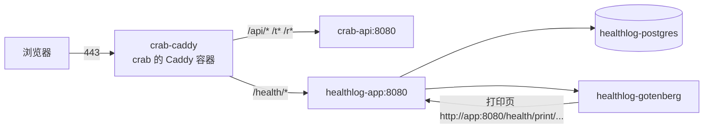

# 部署：与 crab 共用服务器和域名

healthlog 部署在 crab（大闸蟹订单）已经在跑的那台腾讯云轻量服务器上（2 核 4 GB，Ubuntu 24.04），
并且**用 crab 的同一个域名、不同的路径**：`https://<crab 的域名>/health/`。
这份文档记录怎么装，以及从 crab 部署中学到、在这里已经规避掉的坑。

## 拓扑



| 路径（同一域名） | 归属 | 说明 |
|---|---|---|
| `/api/*`、`/t*`、`/r*` | crab | crab 的接口、买家查单页、买家登记页 |
| `/health` | healthlog | 308 跳到 `/health/` |
| `/health/*` | healthlog | 页面、接口（`/health/api/...`）、`/health/healthz` 全部在前缀下 |
| 其余 | crab | crab 的兜底 404 |

| 容器 | 所属 compose | 端口 | 说明 |
|---|---|---|---|
| crab-caddy | /opt/crab-order | 80、443 | **唯一**对外的进程，证书也只有 crab 域名这一张 |
| crab-api | /opt/crab-order | 127.0.0.1:8080 | crab 后端 |
| healthlog-app | /opt/healthlog | 127.0.0.1:8081 | 同时加入 crab 的网络 `crab-order_default`，别名 `healthlog-app` |
| healthlog-postgres | /opt/healthlog | 不暴露 | 数据在 `/opt/healthlog/data/postgres`（绑定挂载） |
| healthlog-gotenberg | /opt/healthlog | 不暴露 | 官方镜像，自带 `fonts-noto-cjk` |

应用本身挂在前缀下（环境变量 `BASE_PATH=/health`）：Caddy 原样转发路径，应用返回的附件、头像 URL，
Cookie 的 Path，前端的资源地址和路由都带着 `/health`。本地开发 `BASE_PATH` 留空，仍从根路径访问。

## 从 crab 借鉴的坑（都已处理）

| 坑 | crab 的教训 | healthlog 的做法 |
|---|---|---|
| 443 上两套服务 | 两个反代同时监听 443，新连接随机落到没有证书的那个，Safari 报「无法建立安全连接」，时好时坏 | 不起自己的 Caddy，往 crab 的站点块里导入一段路由（下面第 2 节） |
| 路径冲突 | crab 在这个域名上占了 `/api/*`、`/t*`、`/r*`（注意 `/t*` 是所有 t 开头的路径） | 全部挂在 `/health/` 下；`deploy.sh` 拒绝 `/api`、t 或 r 开头的前缀 |
| Cookie 串站 | 同域名下两个应用的 Cookie 会互相带上 | Cookie 改名 `hl_sid`，Path 限定为 `/health/`（crab 本身不用 Cookie） |
| 8080 端口 | crab-api 已占 `127.0.0.1:8080` | healthlog 用 `127.0.0.1:8081`，且只绑回环 |
| HTTP/3 | Caddy 宣告 h3 后 Safari 走 UDP 443，云防火墙默认不放通，直接连不上 | 同一个站点块，自动沿用 crab 全局的 `protocols h1 h2` |
| AAAA 记录 / 备案 / 证书 | 未备案、多余的 AAAA 或多条 A 记录都会让 HTTPS 出问题 | 不新增域名和解析记录，也不用备案；证书就是 crab 现有的那张 |
| Docker Hub 拉不动 | 国内直连超时 | 机器已配 `mirror.ccs.tencentyun.com`；Go 用 goproxy.cn，npm 用 npmmirror，apk 用 mirrors.tencent.com（都是 build arg，`.env` 可改） |
| 数据目录权限 | 容器内非 root（uid 10001），宿主目录不归它就写不进 | `sudo make docker-init` 把 `data/storage` 交给 10001 |
| `down -v` 删数据 | 删卷后数据全没 | PostgreSQL 用绑定挂载 `./data/postgres`，`down -v` 删不到；证书卷归 crab，别在 crab 目录执行 `down -v` |
| `.env` 改了不生效 | `docker compose restart` 不重读 `.env` | 改完一律 `docker compose up -d`；改 `BASE_PATH` 还要重新构建（前端构建时写死了前缀），走 `deploy.sh` |
| `.env` 行尾注释 | 朴素解析器会把注释当成值 | `.env.example` 注释都单独成行，填值时也别在行尾写注释 |
| 挂载的 Caddyfile 改了不生效 | 需要重载 | `deploy.sh` 写入路由文件后执行 `caddy reload` |
| 快照当备份 | 磁盘快照可能截到写一半的数据库 | `scripts/backup.sh` 每天 `pg_dump` + 附件镜像，可加密、可同步到 COS |
| 自动部署 | 个人项目不值得给 CI 开一个直连生产的口子 | CI 只跑测试；发布在服务器上执行 `./scripts/deploy.sh`（备份 → 快进拉取 → 构建 → 替换 → 自检 → 失败回滚） |
| 限流拿不到真实 IP | 反代不传 X-Forwarded-For 时所有人共用一个限流桶 | Caddy 默认会设置 X-Forwarded-For，应用用 chi RealIP 取真实 IP 做登录限流 |

## 1. 放代码与写配置

```bash
sudo mkdir -p /opt/healthlog && sudo chown "$USER" /opt/healthlog
git clone git@github.com:RexingRui/famliy-health.git /opt/healthlog   # 私有仓库用只读部署密钥，同 crab
cd /opt/healthlog
cp .env.example .env
sed -i "s|^POSTGRES_PASSWORD=.*|POSTGRES_PASSWORD=$(openssl rand -hex 24)|" .env
sed -i "s|^PRINT_TOKEN_SECRET=.*|PRINT_TOKEN_SECRET=$(openssl rand -hex 32)|" .env
sed -i "s|^PUBLIC_DOMAIN=.*|PUBLIC_DOMAIN=$(grep -E '^CRAB_DOMAIN=' /opt/crab-order/.env | tail -n1 | cut -d= -f2-)|" .env
grep -nE '^(PUBLIC_DOMAIN|BASE_PATH)=' .env     # PUBLIC_DOMAIN 应是 crab 的域名；BASE_PATH 留空即 /health
sudo make docker-init
```

DNS、证书、云防火墙都不用动。

## 2. 让 crab 的 Caddy 转发 `/health/`（一次性）

crab 的站点块最后有一个兜底 `handle { respond "Not Found" 404 }`，需要在 crab 仓库做一次小改动，
让它从一个共享目录导入其他应用的路由：

`/opt/crab-order/deploy/Caddyfile`，在 `{$CRAB_DOMAIN} { ... }` **里面**、兜底的 `handle {` 之前加一行：

```caddy
	# 同域名下其他应用的路由（healthlog 的 /health/ 等），由各自的部署脚本写入
	import /etc/caddy/routes/*.caddy
```

`/opt/crab-order/docker-compose.yml` 的 `caddy` 服务 `volumes` 加一行：

```yaml
      - /opt/caddy-routes:/etc/caddy/routes:ro
```

然后：

```bash
sudo mkdir -p /opt/caddy-routes && sudo chown "$USER" /opt/caddy-routes
cd /opt/crab-order && docker compose --profile proxy up -d --force-recreate caddy
```

目录为空时 Caddy 只打一条警告，crab 照常工作。以后 healthlog 的路由由 `deploy.sh` 从
`deploy/caddy/healthlog.caddy` 渲染到 `/opt/caddy-routes/healthlog.caddy`，并执行
`docker exec crab-caddy caddy reload`，不需要再动 crab。

> crab 的 compose 项目名是 `crab-order`，所以它的网络叫 `crab-order_default`。如果名字不同，改 `.env` 里的 `EDGE_NETWORK`。

## 3. 首次启动

```bash
cd /opt/healthlog
./scripts/deploy.sh                    # 首次也走它：构建、启动、写 Caddy 路由、自检
docker compose exec app healthlog user create --username me    # 交互输入两次密码（至少 8 位）
```

`deploy.sh` 自检的是容器内的 `/health/healthz`（数据库和 Gotenberg 都通才算过）。Gotenberg 镜像约 1.5 GB，首次拉取较慢。

验证：

```bash
D=$(grep -E '^PUBLIC_DOMAIN=' .env | cut -d= -f2-)
curl -s localhost:8081/health/healthz                          # 本机
curl -sI https://$D/health | grep -iE '^(HTTP|location)'       # 308 → /health/
curl -sI https://$D/health/ | head -n1                         # HTTP/2 200
curl -s  https://$D/health/api/me                              # {"error":{"code":"unauthorized",...}}
curl -sI https://$D/t | head -n1                               # crab 的查单页不受影响
```

## 4. 日常

| 操作 | 命令 |
|---|---|
| 发布新版本 | `./scripts/deploy.sh`（或本地 `ssh <服务器> 'cd /opt/healthlog && ./scripts/deploy.sh'`） |
| 只改了 `.env`（`BASE_PATH` 除外） | `docker compose up -d` |
| 看日志 | `docker compose logs -f app`（JSON，不含记录正文） |
| 改密码 | `docker compose exec app healthlog user passwd --username me`（会注销全部会话） |
| 手动备份 | `./scripts/backup.sh` |
| 紧急回滚镜像 | `docker image tag healthlog:rollback healthlog:latest && docker compose up -d --force-recreate app` |
| 进数据库 | `docker compose exec postgres psql -U healthlog` |

迁移只向前执行。回滚代码不会回滚表结构；需要时用 `backup/db/` 里部署前那份 dump 恢复：

```bash
docker compose stop app
docker compose exec -T postgres pg_restore -U healthlog -d healthlog --clean --if-exists < backup/db/healthlog-<时间>.dump
docker compose start app
```

## 5. 备份

```cron
0 3 * * * /opt/healthlog/scripts/backup.sh >> /var/log/healthlog-backup.log 2>&1
```

- 数据库：`backup/db/healthlog-*.dump`，保留 `KEEP_DAYS` 天（默认 30）。
- 附件：`backup/storage/` 是 `data/storage/` 的镜像（附件只写一次，镜像天然增量）。
- 加密：`.env` 里填 `BACKUP_AGE_RECIPIENT`（`apt install age`，用 `age-keygen` 生成密钥，私钥别放这台机器上）。
- 异地：`.env` 里填 `BACKUP_REMOTE`（rclone 目标，如同地域 COS 内网域名，不占公网流量），附件建议用 rclone crypt 远端。
- 试用期第 2 周在另一台机器上按第 4 节的 `pg_restore` 做一次完整恢复演练，确认记录和附件都能打开。

## 常见问题

**`deploy.sh` 报找不到网络 `crab-order_default`**：crab 没在跑，或项目名不同。`docker network ls` 看实际名字，写进 `EDGE_NETWORK`。

**Caddy 重载失败**：`docker logs crab-caddy`。多半是 `/opt/caddy-routes` 没挂进去，或 `import` 写在了站点块外面（第 2 节）。

**`/health/` 返回 crab 的 404**：路由没导入成功。`docker exec crab-caddy cat /etc/caddy/routes/healthlog.caddy` 看文件在不在，再看 crab 的 Caddyfile 里有没有那行 `import`。

**页面白屏、资源 404**：前端构建时的前缀和运行时 `BASE_PATH` 不一致。改过 `BASE_PATH` 后要重新构建：`./scripts/deploy.sh`。

**页面偶尔打不开（Safari）**：和 crab 是同一个站点，直接用 crab 的 `./scripts/tls-check.sh` 排查。

**导出 PDF 报「生成 PDF 失败」**：`docker compose logs gotenberg`。打印页由 Gotenberg 通过 `http://app:8080/health/print/...` 打开，不走公网。

**内存**：粗估 PostgreSQL + Gotenberg（Chromium）+ 应用常驻不到 1 GB，加上 crab 仍在 4 GB 以内；首次部署后用 `docker stats --no-stream` 看实际值。
