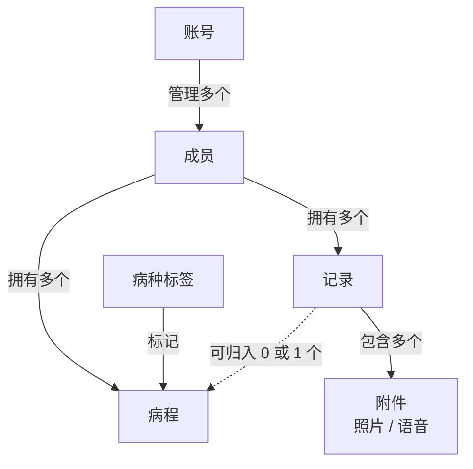
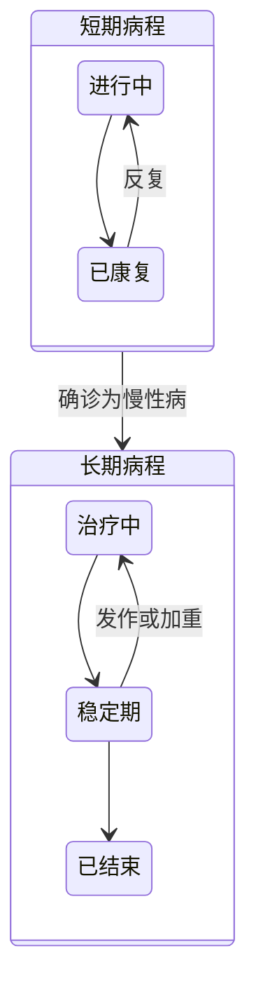
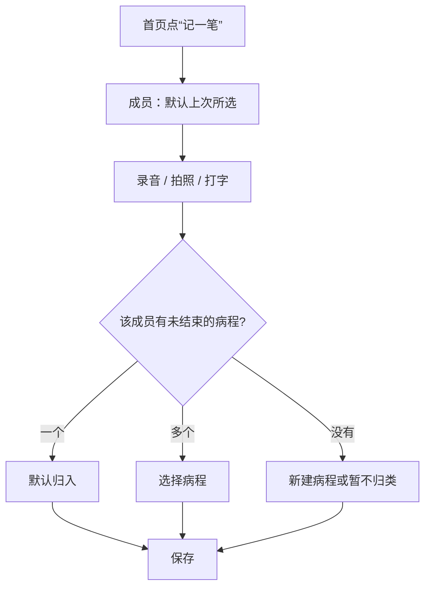

# 家庭健康管理 · 产品方案（MVP）

> 原文：[家庭健康管理 · 产品方案（MVP）](https://claude.ai/code/artifact/2cee63c4-4748-404b-b54c-fae6ba3f4f56)。本文件为仓库内快照，如与原文冲突以原文最新版为准，并同步更新本文件。

## 产品概述

一款记录家人从生病到康复全过程的工具：手机随手记，电脑汇总看，一键导出 PDF 报告。

- **定位**：家庭自用的病程记录本，不做问诊，不给医疗建议。
- **目标用户**：负责照顾家人健康的成年人，比如有孩子的父母、照顾老人的子女。
- **核心价值**：就诊时病史讲得清，复诊时有据可查，报销时材料齐全。

设计原则：

1. **一套功能，两端侧重不同**：手机端优先“记”，电脑端优先“看”和“整理”。成员的添加和编辑只在手机端，其余功能两端都能用。
2. **先存后整理**：记录时不强制分类。没归类的记录进入“待整理”，之后再补。
3. **录入要快**：最短路径是“录音 → 保存”，10 秒内完成。
4. **不依赖 AI**：MVP 原样保存文字、照片和语音，后续可在原始数据上叠加 AI 能力。

## MVP 范围

本期只做“记录 → 归类 → 浏览 → 导出”这条主线，协作、提醒和 AI 全部后置。

| 模块 | 本期做 | 本期不做 |
|---|---|---|
| 账号 | 账号密码登录，一个账号管理全部成员 | 开放注册、家庭共享、多人协作、权限划分 |
| 成员 | 在手机端添加、编辑、归档成员档案 | 成员绑定独立账号 |
| 记录 | 文字、照片、语音混合记录；可选的症状程度、体温、用药、就诊、治疗字段；随时编辑和补录 | 语音转文字、OCR、AI 信息提取 |
| 病程 | 短期和长期病程、记录归类、状态流转 | 病程之间的关联分析 |
| 浏览 | 总览、时间线、日历、按病种汇总、趋势曲线、待整理、文字搜索 | 费用分析、跨病种统计 |
| 导出 | 病程报告、成员健康档案两种 PDF | Word 导出、分享链接 |
| 提醒 | 无 | 用药提醒、复诊提醒 |

## 核心概念与关系

每条记录必须属于一个成员，但可以暂时不属于任何病程；病程再按病种标签归类。

虚线表示“可选归属”：没有归入病程的记录，会出现在“待整理”列表中。

| 概念 | 说明 | 示例 |
|---|---|---|
| 账号 | 能登录并操作系统的人 | 妈妈的手机号 |
| 成员 | 被记录的家人，不需要有账号 | 小明，儿子，2019-05-02 出生 |
| 病种标签 | 病的名称，可在多个病程间复用 | 感冒、哮喘 |
| 病程 | 一次生病，或一段长期治疗 | 小明 · 感冒 · 2026-09 |
| 记录 | 某个时刻记下的一条信息 | 21:30 体温 38.6 °C，附语音一段 |
| 附件 | 记录中的照片或语音文件 | 处方照片、一段 40 秒的语音 |

## 病程设计

每条记录最终都应归入一个病程。病程分为短期和长期两种，核心区别是有没有明确的结束点。

| 维度 | 短期病程 | 长期病程 |
|---|---|---|
| 典型例子 | 感冒、发烧、肠胃炎 | 哮喘、过敏性鼻炎、高血压 |
| 持续时间 | 几天到几周 | 数月到数年 |
| 状态 | 进行中、已康复 | 治疗中、稳定期、已结束 |
| 同一病种 | 每次生病新建一个病程 | 通常只有一个病程，持续追加记录 |
| 默认名称 | 病种 + 年月，如“感冒 · 2026-09” | 病种名，如“哮喘” |
| 浏览方式 | 时间线、日历、趋势曲线三种视图 | 同样三种视图，时间线按年月分组，可按记录类型筛选 |
| 常用 PDF | 单次病程报告 | 指定时间段的治疗报告 |

短期病程可以转为长期病程，比如反复喘息后确诊为哮喘，原有记录全部保留。

### 先记录，后定名

刚生病时往往还不知道是什么病。新建病程时，病种可以先填症状，比如“发烧”，确诊后再改成“支原体肺炎”。病种从预置列表中选择，也可以自定义。

### 记录如何归入病程

- 该成员只有一个未结束的病程：默认选中它，可以手动修改。
- 有多个未结束的病程：列出供选择，默认选中最近有记录的那个。
- 没有未结束的病程：可以新建病程，也可以选“暂不归类”，放入待整理。
- 一条记录最多属于一个病程。

### 长期病程中的急性发作

MVP 阶段不为急性发作单独新建病程。发作期间的记录直接记在长期病程里，打上“发作”标记，并把状态切到“治疗中”。浏览和导出时，可以单独筛选出所有发作记录。

### 结束提示

短期病程超过 14 天没有新记录时，打开该病程会提示“是否已康复”。系统只提示，不自动关闭。

## 功能说明

功能分为六块：账号、成员、记录、病程、浏览和导出。除成员的基础字段外，其余字段一律选填。

### 账号

- MVP 只有一个用户，用账号和密码登录即可。账号直接在后台创建，不开放注册，也不做短信验证。一个账号管理全部成员。
- 登录状态保持较长时间，比如 30 天，手机上记录时不用反复登录。
- 首次在手机上登录后，引导用户添加第一个成员。电脑端还没有成员时，提示用户去手机上添加。

### 成员管理

| 字段 | 必填 | 说明 |
|---|---|---|
| 称呼 | 是 | 如“小明”“爸爸” |
| 关系 | 是 | 本人、配偶、子女、父母、祖辈、其他 |
| 性别 | 是 | |
| 出生日期 | 是 | 儿童用药与年龄相关，报告中显示当时年龄 |
| 头像 | 否 | 用于快速切换成员 |
| 过敏史 | 否 | 药物和食物过敏，报告首页醒目显示 |
| 血型 | 否 | |
| 备注 | 否 | 其他需要医生知道的信息 |

成员的添加和编辑只在手机端进行。电脑端只展示成员信息，不提供添加和编辑入口。

长期疾病不单独填写，由该成员的长期病程自动汇总显示。成员可以归档：数据保留，但不再出现在快速切换中。删除成员需要二次确认，其全部记录会一并删除。

### 记录

一条记录由时间、成员、内容三部分组成，另有可选的类型字段。

- **内容**：文字、照片、语音可以任意组合。每条最多 9 张照片，每段语音最长 3 分钟。
- **语音补充文字**：每段语音旁可选填一句文字，用于搜索和 PDF 展示。
- **两个时间**：“发生时间”默认为当前，可以修改；“录入时间”由系统自动记录。两者相差超过 1 小时的记录，显示“补录”标记。
- **编辑与补录**：任何记录都可以随时修改时间、文字和字段，也可以追加或删除照片和语音。比如当时不方便说话，可以先打几个字保存，之后再补一段语音。
- **发作标记**：长期病程中的记录可以标记为“发作”。

| 类型（可选） | 附加字段（均选填） | 用途 |
|---|---|---|
| 症状 | 程度（0–10 分） | 记录疼痛或不适的程度，生成趋势曲线 |
| 体温 | 体温（°C） | 生成体温曲线 |
| 用药 | 药名、剂量、单位 | 每服一次药记一条，发生时间就是服药时间 |
| 就诊 | 医院、科室、医生、费用（元） | 就诊列表与费用合计 |
| 治疗 / 康复 | 项目、机构、费用（元） | 理疗、针灸、推拿、康复训练等 |
| 检查 | 检查项目 | 检查报告照片归档 |
| 其他 | 无 | 如“已向学校请假 2 天” |

用药记录提供“再记一次”按钮，一键复制药名和剂量，时间取当前。新增用药记录时，页面显示同一种药上次的服用时间和间隔小时数，方便核对。系统只做记录，不给任何剂量建议。

### 病程管理

- 新建和编辑病程：名称、病种、短期或长期、起止日期。
- 切换状态：短期和长期病程的详情页功能一致，都有“切换状态”和“导出报告”，区别只在状态选项。短期病程可选进行中、已康复；长期病程可选治疗中、稳定期、已结束。短期病程也可以转为长期病程。
- 把记录移到其他病程，或移回待整理。
- 删除病程时，其中的记录退回待整理，不会被删除。

### 浏览维度与搜索

- **时间线**：按时间倒序查看记录，可以跨病程，也可以只看一个病程。
- **日历**：按月显示，每天用不同颜色的点标出症状、用药、就诊和治疗，点某一天查看当天记录。适合长期病程回看“哪天疼、哪天做了康复”。
- **按病种**：同一成员同一病种的全部病程，比如小明历次感冒的次数、每次持续天数和用过的药。
- **按记录类型**：只看就诊、只看用药或只看治疗，可以叠加成员和时间段筛选。
- **趋势曲线**：体温和症状程度随时间变化的折线图。
- **搜索**：文字搜索覆盖文字内容、语音补充文字、医院名称和药名。

### PDF 导出

| 报告 | 范围 | 包含内容 |
|---|---|---|
| 病程报告 | 一个病程；长期病程可选时间段 | 成员信息与过敏史、病程概况、体温和症状程度曲线、就诊与治疗记录、每次服药的时间和剂量、全部记录时间线、费用合计 |
| 成员健康档案 | 一个成员 + 时间段 | 成员信息与过敏史、长期病程列表、时间段内每个病程的一行摘要 |

语音在 PDF 中显示为“语音 1 段，40 秒”及其补充文字。照片可选择不附带、附缩略图，或作为附录附原图。

## 页面清单

共 9 个页面，全部采用响应式设计。“侧重端”决定交互按哪一端优化，另一端保证可用即可。成员管理例外，只在手机端提供。

| 页面 | 侧重端 | 主要内容 |
|---|---|---|
| 登录 | 两端 | 账号密码登录 |
| 首页 | 手机 | 成员头像快速切换、“记一笔”大按钮、未结束的病程卡片、待整理数量 |
| 记一笔 | 手机 | 文字框、按住录音、拍照或选图、可选类型与字段、归属病程 |
| 病程详情 | 两端 | 病程信息、状态切换、记录时间线（可切换为日历或趋势曲线）；电脑端两栏，左侧时间线，右侧详情和大图 |
| 待整理 | 电脑 | 左侧是未归类的记录，可多选后批量归入病程；右侧编辑面板可修改成员、发生时间、类型、文字、语音和照片，并单独指定归属 |
| 家庭总览 | 电脑 | 每个成员一栏：当前状态、未结束的病程、最近记录 |
| 成员主页 | 电脑 | 成员信息与长期病程；时间线、日历、按病种三种视图，支持筛选与搜索 |
| 成员管理 | 手机 | 成员列表、添加成员、编辑、归档（仅手机端） |
| 导出 | 电脑 | 选择报告类型、范围和照片选项，预览后下载 |

导航方面，手机端使用底部标签栏（首页、记一笔、成员），电脑端使用左侧菜单（总览、待整理、成员、导出）。首页和家庭总览可以共用一个路由，按屏幕宽度切换布局。

## 关键流程

快速记录的最短路径是 3 次点击：记一笔 → 录音 → 保存。

### 快速记录（手机）

类型、体温、费用等字段都收在“更多”里，不展开也能直接保存。

### 整理归类（电脑）

1. 打开“待整理”，点一条记录，在右侧编辑面板里听语音、看照片。
2. 补充或修改类型字段、文字和发生时间，也可以追加语音和照片，然后保存。
3. 多选记录，归入已有病程或新建病程。
4. 进入病程详情检查时间线，并更新病程状态。

### 导出报告（电脑）

1. 在病程详情或成员主页点“导出”，范围自动带入。
2. 选择报告类型、时间段和照片选项。
3. 预览后下载 PDF。

## 典型场景验证

两个场景都能走通，依赖的是本期新增的症状程度、治疗类型、补录和日历视图。

### 场景一：孩子轻微感冒，居家休息

| 时间 | 操作 | 用到的能力 |
|---|---|---|
| 第 1 天早上 | 记一笔，选“小明”，录一段语音描述流鼻涕和咳嗽，新建短期病程“感冒” | 语音记录、新建病程 |
| 第 1 天 | 记一条“已向学校请假 2 天” | 其他类型 |
| 第 1 天中午 | 类型选“用药”，填写药名和剂量 | 用药记录 |
| 第 1 天晚上 | 在上一条用药记录上点“再记一次”，页面显示距上次服用已过 8 小时 | 再记一次、间隔提示 |
| 每天 | 记体温，或用语音记下精神和食欲 | 体温曲线 |
| 第 3 天 | 点“切换状态”，选“已康复”，结束病程 | 状态切换 |
| 事后 | 导出病程报告，其中列出每次服药的时间和剂量 | PDF 导出 |

### 场景二：腰椎间盘突出，长期记录

| 情况 | 操作 | 用到的能力 |
|---|---|---|
| 开始记录 | 新建长期病程“腰椎间盘突出” | 长期病程 |
| 某天特别疼 | 记一条症状，程度 8 分，标记“发作”，病程切到“治疗中” | 症状程度、发作标记 |
| 做了康复 | 记一条“治疗 / 康复”，项目填理疗，附上机构和费用 | 治疗类型 |
| 去了医院 | 记一条“就诊”，拍下病历和检查报告 | 就诊记录、照片 |
| 回看 | 用日历看哪天疼、哪天康复、哪天就诊；用趋势曲线看疼痛变化 | 日历、趋势曲线 |
| 复诊前 | 导出近 6 个月的治疗报告给医生看 | PDF 导出 |

### 补录

当时不方便录音，可以先打几个字保存，之后打开这条记录，点“追加语音”补上。事后才想起的事情，新建一条记录，把发生时间改成当时即可，系统会标记为“补录”。

### 多维度查看

“同一个人同一种病”对应成员主页的“按病种”视图，适合反复发生的短期病，比如历次感冒。长期病程本身就是同一种病，直接在病程详情里切换时间线、日历或曲线即可。

## 技术要点与风险

最大的技术风险是手机端录音的兼容性。产品在系统浏览器中使用，建议开发第一周就在 iOS Safari 和安卓 Chrome 上实测。

| 事项 | 要点 | 建议 |
|---|---|---|
| 语音录制 | 浏览器录音需要 HTTPS；iOS 录出 mp4/aac，安卓 Chrome 多为 webm | 上传后在服务端用 ffmpeg 统一转为 m4a 或 mp3 |
| 微信内置浏览器 | 不作为目标环境，录音支持也不稳定 | 检测到在微信中打开时，提示用户改用浏览器 |
| 图片 | 手机原图通常有几 MB，iPhone 可能是 HEIC 格式 | 前端压缩到长边约 2000 像素，统一转为 JPEG 后上传 |
| 弱网 | 医院里网络常常不好 | 上传失败时在本地暂存草稿，并提示重试 |
| PDF 生成 | 中文字体和大量图片容易出问题 | 在服务端用 HTML 模板 + 无头浏览器渲染，版式和字体可控 |
| 附件存储 | 照片和语音不应存在数据库里 | 存对象存储，设为私有，通过临时签名链接访问 |
| 数据安全 | 健康数据高度敏感 | 全站 HTTPS、定期备份、支持注销账号并删除全部数据 |

目前仅自用，暂不涉及。如果以后面向公众上线，健康信息属于《个人信息保护法》中的敏感个人信息，需要准备隐私政策并取得用户的单独同意。

## 后续迭代与已确认事项

MVP 之后，最值得优先做的是家庭共享和语音转文字。这两项的扩展空间在本期都已预留。

| 方向 | 说明 | 本期预留 |
|---|---|---|
| 家庭共享 | 多个账号共同维护同一批成员 | 成员表预留归属字段 |
| 语音转文字 | 自动转写，补全搜索和 PDF 内容 | 保留全部原始音频 |
| AI 信息提取 | 从文字和语音中提取体温、药名等 | 类型字段已经结构化 |
| 提醒 | 用药提醒、复诊提醒 | 可用浏览器推送；iOS 需要先把网页添加到主屏幕 |
| OCR | 识别处方和检查报告 | 保留原图 |
| 统计分析 | 生病频次、费用趋势 | 病种标签统一管理 |

### 已确认事项

- [x] 登录方式：MVP 只有一个用户，用账号密码登录，不开放注册。
- [x] 使用环境：在手机和电脑的系统浏览器中使用，不针对微信内置浏览器做适配。
- [x] 体检、疫苗等非疾病记录：不纳入。
- [x] 使用范围：目前仅自用，暂不涉及公众上线的合规工作。
- [x] 照片和语音上限：采用建议值，每条最多 9 张照片，每段语音最长 3 分钟。
