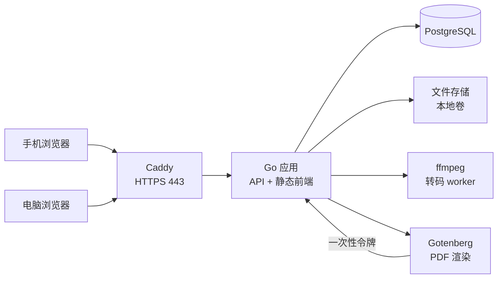
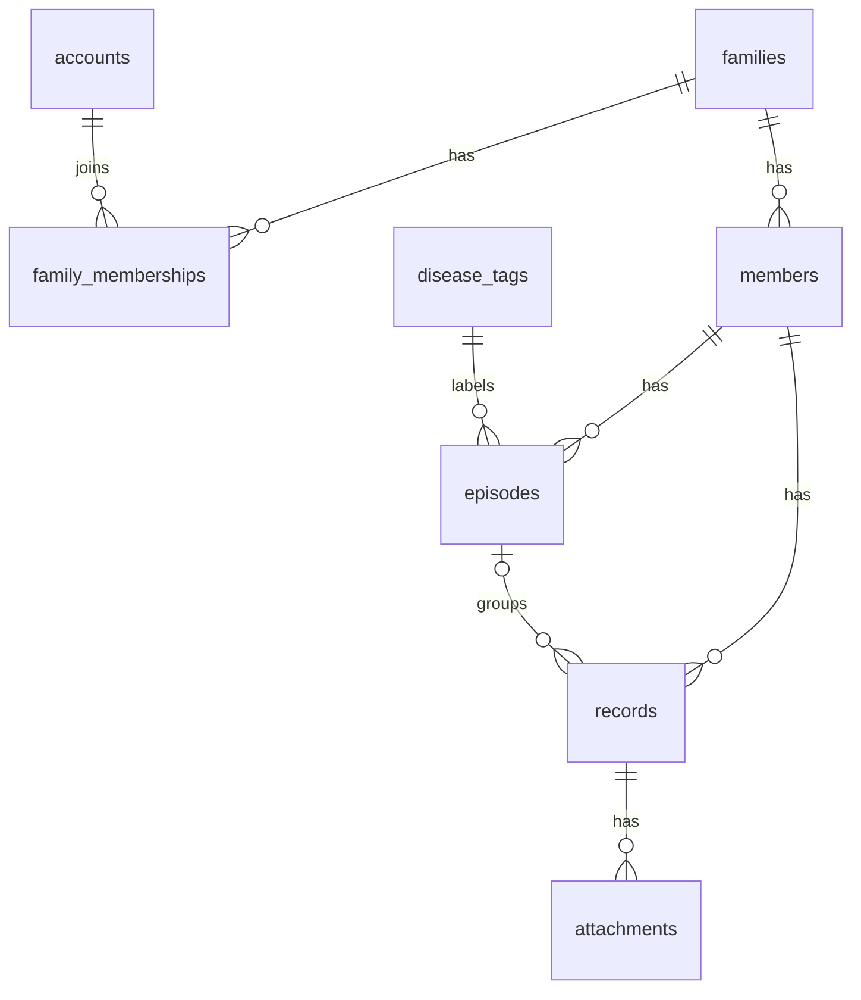
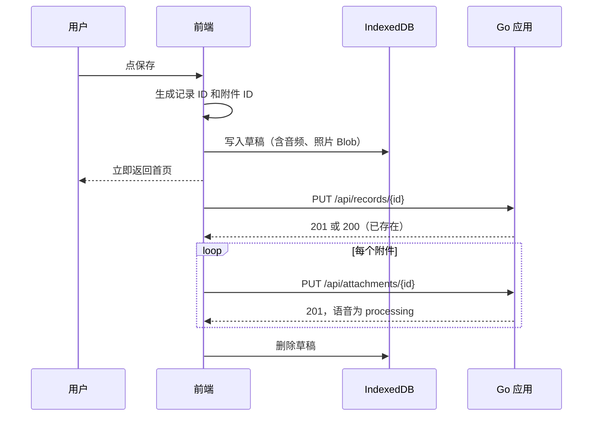
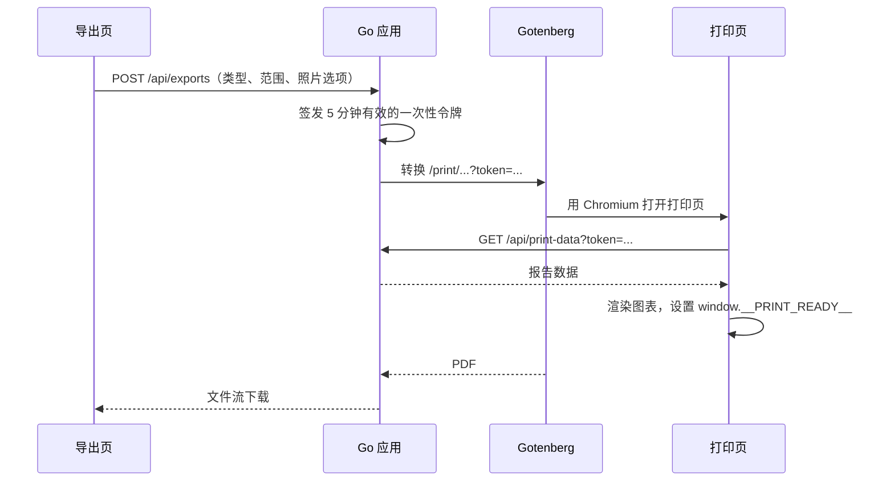

# 家庭健康管理 · 前后端技术方案（MVP）

> 原文：[家庭健康管理 · 前后端技术方案（MVP）](https://claude.ai/code/artifact/6b860948-4fcd-4a17-8cd3-67fbcd291543)。本文件为仓库内快照，如与原文冲突以原文最新版为准，并同步更新本文件。

## 概述

本方案采用 React + TypeScript 单页 H5 前端、Go 单体后端、PostgreSQL 数据库，一台服务器用 docker compose 部署，目标是约 4 周完成 MVP 并进入一个月的自用试用。

方案依据两份材料：产品方案（MVP） 和 设计稿。设计取舍遵循以下约束：

| 约束 | 对技术方案的影响 |
|---|---|
| 试用期只有一个用户 | 账号用命令行创建，不做注册、短信、找回密码；不需要水平扩展 |
| 只做 H5，在系统浏览器中使用 | 手机和电脑共用一个响应式 SPA；不做 PWA 离线，不适配微信内置浏览器 |
| 录音是核心录入方式 | 必须 HTTPS；服务端统一转码；第一周做真机验证 |
| 弱网下要能存下来 | 上传失败的记录存为本地草稿，联网后重试 |
| 以后会推广并支持家庭共享 | 数据从第一天起按家庭隔离，ID 由客户端生成 |
| 不依赖 AI | 原样保存文字、照片、语音，后续可在原始数据上叠加能力 |

不在本期范围：开放注册、家庭共享、语音转文字、OCR、提醒、Word 导出、分享链接。

## 技术栈

选型原则是依赖少、部署简单、隔几个月回来还能直接改。版本号为开工时的建议值，以实际最新稳定版为准。

| 层 | 选型 | 理由 |
|---|---|---|
| 前端框架 | React 19 + TypeScript + Vite | 生态成熟，响应式单页即可覆盖两端 |
| 路由 | React Router | 按路由切换手机和电脑布局 |
| 服务端状态 | TanStack Query | 缓存、重试、乐观更新，页面回到前台自动刷新 |
| 样式 | Tailwind CSS | 设计稿的颜色和间距可直接映射为主题变量 |
| 图表 | ECharts | 体温和症状曲线、按病种柱状图；屏幕和 PDF 共用 |
| 本地草稿 | IndexedDB（idb-keyval） | 只存上传失败的记录和附件，不做完整离线 |
| 图片处理 | browser-image-compression + heic2any | 长边压到 2000 像素，HEIC 转 JPEG |
| 后端语言 | Go 1.23+ | 团队主力；单二进制；长期维护成本低 |
| HTTP 路由 | chi | 贴近标准库，中间件简单 |
| 数据库 | PostgreSQL 16 | 为以后多用户留余量；JSONB 存类型字段 |
| 数据访问 | pgx + sqlc | 手写 SQL 生成类型安全代码，不用 ORM |
| 迁移 | goose | 迁移文件和代码一起提交 |
| 接口契约 | OpenAPI 3 + oapi-codegen + openapi-typescript | 一份定义生成 Go 服务端接口和前端 TS 类型 |
| 语音转码 | ffmpeg | 统一转为 AAC 编码的 m4a，iOS 和安卓都能播放 |
| PDF | Gotenberg（无头 Chromium） | 渲染前端报告页，中文字体和图表可控 |
| 反向代理 | Caddy | 自动申请和续期 HTTPS 证书 |
| 部署 | docker compose | 一台 2 核 4 GB 服务器即可 |

前端打包产物通过 Go 的 `embed` 编进后端二进制，由后端直接提供静态文件，前后端同域，不存在跨域和 Cookie 问题。

## 系统架构

整个系统是一台服务器上的 4 个容器，只有 Caddy 对外暴露 443 端口。



请求链路如下：浏览器所有请求都到 Caddy，Caddy 转发给 Go 应用。`/api/*` 走接口，其余路径返回前端的 `index.html`。附件经应用写入文件存储；语音由应用内的转码 worker 调用 ffmpeg 处理；导出 PDF 时，应用请 Gotenberg 打开前端的打印页，打印页用一次性令牌回调应用拉取数据。

| 组件 | 运行方式 | 说明 |
|---|---|---|
| Caddy | 官方镜像 | 证书自动续期；设置上传体积上限 50 MB |
| Go 应用 | 自建镜像，内含 ffmpeg | 单进程，API、静态文件、后台 worker 都在里面 |
| PostgreSQL | 官方镜像，数据卷持久化 | 只在内网可访问 |
| Gotenberg | 官方镜像，内置中文字体 | 只在内网可访问；镜像需加装 Noto Sans SC |
| 文件存储 | 宿主机目录挂载 | 通过 `Storage` 接口访问，以后可换成对象存储 |

后台任务（语音转码、清理过期令牌）用数据库任务表加应用内 goroutine 轮询实现，不引入消息队列。单用户下每天任务量只有几十个。

## 数据模型

所有业务数据都挂在 `family_id` 下，每个查询都带家庭条件。试用期只有一个家庭一个账号，但以后做家庭共享只需往 `family_memberships` 里加行，不用迁移数据。



通用约定：主键为 UUIDv7。记录和附件的 ID 由前端生成，重复提交时后端按 ID 幂等处理。时间一律存 `timestamptz`，按天分组和日历统计都按 `Asia/Shanghai` 计算。每张业务表都有 `created_at` 和 `updated_at`。

### 账号与家庭

| 表 | 主要字段 | 说明 |
|---|---|---|
| families | id, name | 试用期只有一行 |
| accounts | id, username（唯一）, password_hash, display_name, last_login_at | 密码用 bcrypt，cost 12 |
| family_memberships | family_id, account_id, role | 复合主键；本期 role 只有 owner |
| sessions | id（令牌的 SHA-256）, account_id, expires_at, last_seen_at, user_agent | 数据库只存令牌哈希；30 天有效，活跃时滑动续期 |

### members（成员）

| 字段 | 类型 | 说明 |
|---|---|---|
| nickname | text，必填 | 称呼，如“小明” |
| relation | enum，必填 | self, spouse, child, parent, grandparent, other |
| gender | enum，必填 | male, female |
| birth_date | date，必填 | 报告按记录发生日计算当时年龄 |
| avatar_id | uuid，可空 | 指向 attachments |
| allergies, notes | text，可空 | 过敏史、备注 |
| blood_type | enum，可空 | A, B, AB, O, unknown |
| sort_order | int | 快速切换中的顺序 |
| archived_at | timestamptz，可空 | 归档后不出现在快速切换中 |

删除成员时级联删除其病程、记录和附件，附件文件由后台任务清理。

### disease_tags（病种标签）与 episodes（病程）

| 表 | 主要字段 | 说明 |
|---|---|---|
| disease_tags | id, family_id（可空）, name | family_id 为空表示系统预置；(family_id, name) 唯一 |
| episodes | id, member_id, disease_tag_id, name, kind, status, started_on, ended_on | kind 为 short 或 long |

状态取值随 kind 变化，由后端校验：短期病程为 active（进行中）、recovered（已康复）；长期病程为 treating（治疗中）、stable（稳定期）、ended（已结束）。短期转长期时，active 映射为 treating，recovered 映射为 stable，原有记录不变。删除病程时，其记录的 `episode_id` 置空，回到待整理（外键 ON DELETE SET NULL）。

### records（记录）

常查询、常统计的字段单独建列，其余类型专属字段放 `details` JSONB。

| 字段 | 类型 | 说明 |
|---|---|---|
| id | uuid | 前端生成 |
| member_id | uuid，必填 | 所属成员 |
| episode_id | uuid，可空 | 为空即“待整理” |
| type | enum，可空 | symptom, temperature, medication, visit, treatment, exam, other；为空表示未选类型 |
| occurred_at | timestamptz | 发生时间，可修改 |
| created_at | timestamptz | 录入时间，系统写入；与发生时间相差超过 1 小时即显示“补录”，不单独存 |
| body | text | 文字内容 |
| is_flare | bool | 发作标记，仅长期病程使用 |
| severity | smallint 0–10 | 症状程度，用于趋势曲线 |
| temperature | numeric(3,1) | 体温，单位 °C |
| med_name, med_dose, med_unit | text, numeric, text | 用药；med_unit 取 ml、片、粒、袋 |
| cost_cents | int | 就诊或治疗费用，单位为分 |
| details | jsonb | 就诊：hospital, department, doctor；治疗：item, institution；检查：item |
| search_text | text | 应用写入时拼接正文、语音补充文字、药名、医院名，供搜索使用 |
| created_by | uuid | 录入账号，为家庭共享预留 |

### attachments（附件）

| 字段 | 类型 | 说明 |
|---|---|---|
| id | uuid | 前端生成 |
| record_id | uuid，可空 | 头像附件为空 |
| kind | enum | photo, audio, avatar |
| status | enum | pending, processing, ready, failed |
| original_key, storage_key | text | 原始文件和处理后文件在存储中的路径 |
| mime, size_bytes | text, bigint |  |
| duration_ms | int | 语音时长，上限 180000 |
| width, height | int | 照片尺寸 |
| caption | text | 语音的补充文字 |
| sort_order | int | 同一记录内的顺序 |

每条记录最多 9 张照片，由后端校验。

### jobs（后台任务）

字段为 id, kind, payload（jsonb）, status, attempts, run_after, last_error。取任务用 `SELECT … FOR UPDATE SKIP LOCKED`，失败按 1、5、30 分钟退避重试，最多 3 次。

### 索引

| 索引 | 服务的查询 |
|---|---|
| records (member_id, occurred_at DESC) | 成员时间线、日历 |
| records (episode_id, occurred_at DESC) | 病程时间线、趋势曲线 |
| records (family_id, occurred_at DESC) WHERE episode_id IS NULL | 待整理列表和数量 |
| records (member_id, med_name, occurred_at DESC) WHERE type = 'medication' | “上次服用”提示 |
| episodes (member_id, status) | 首页进行中的病程 |
| attachments (record_id, sort_order) | 记录详情 |

搜索本期直接用 `search_text ILIKE`。数据量到几万条后再加 pg_trgm 索引。

## API 设计

接口为 REST + JSON，统一前缀 `/api`，契约写在 `api/openapi.yaml`，Go 服务端接口和前端 TS 类型都由它生成。

### 约定

- **命名**：JSON 字段用 camelCase，前端可直接使用生成的类型。
- **时间**：ISO 8601 带时区偏移，如 `2026-09-24T21:30:00+08:00`；纯日期用 `2026-09-24`。
- **创建即幂等**：记录和附件用 `PUT /{id}` 创建，ID 由前端生成。同一 ID 重复提交返回已有资源，弱网重试不会产生重复数据。
- **分页**：列表用游标分页，游标编码 (occurred_at, id)，默认每页 50 条。
- **鉴权**：登录后下发 Cookie `sid`（HttpOnly、Secure、SameSite=Lax）。写请求额外校验 `Origin` 头，防 CSRF。
- **错误格式**：`{"error":{"code":"validation_failed","message":"体温需在 34.0 到 43.0 之间","fields":{"temperature":"out_of_range"}}}`，HTTP 状态码按语义使用 400、401、404、409、413、422。

### 接口清单

| 方法 | 路径 | 用途 |
|---|---|---|
| POST | /api/auth/login | 用户名密码登录；同一 IP 连续失败 5 次锁定 15 分钟 |
| POST | /api/auth/logout | 注销当前会话 |
| GET | /api/me | 当前账号和家庭 |
| GET | /api/home | 首页和总览的聚合数据：成员、未结束病程、每个病程的最新体温和上次用药、待整理数量 |
| GET | /api/members | 成员列表，可带 `includeArchived` |
| POST | /api/members | 添加成员 |
| GET / PATCH / DELETE | /api/members/{id} | 成员详情、编辑、删除（删除需带 `confirm=true`） |
| POST | /api/members/{id}/archive, /unarchive | 归档、取消归档 |
| GET | /api/members/{id}/by-disease | 按病种汇总，参数 `range=1y/3y/all` |
| GET / POST | /api/disease-tags | 病种标签列表（预置 + 自定义）、新增自定义 |
| GET | /api/episodes | 病程列表，参数 `memberId`、`open=true`、`diseaseTagId` |
| POST | /api/episodes | 新建病程 |
| GET / PATCH / DELETE | /api/episodes/{id} | 详情（含记录数、天数、费用合计）、编辑与切换状态、删除 |
| GET | /api/episodes/{id}/calendar | 参数 `month=2026-09`，返回每天各类型的记录数和最高症状程度 |
| GET | /api/episodes/{id}/trend | 体温和症状程度的时间序列，可带 `from`、`to` |
| GET | /api/records | 统一的记录查询，参数见下 |
| PUT | /api/records/{id} | 创建记录（幂等） |
| PATCH / DELETE | /api/records/{id} | 编辑、删除记录 |
| POST | /api/records/assign | 批量归入：`{ids, episodeId}`，`episodeId` 为 null 表示移回待整理；也可带 `newEpisode` 同时新建 |
| GET | /api/medications/last | 参数 `memberId`、`medName`，返回上次服用时间 |
| PUT | /api/attachments/{id} | 上传附件（multipart），字段含 `recordId`、`kind`、`durationMs` |
| GET | /api/attachments/{id}/file | 读取文件，支持 Range，语音可拖动播放；参数 `variant=thumb` 取缩略图 |
| PATCH / DELETE | /api/attachments/{id} | 修改语音补充文字或顺序、删除附件 |
| POST | /api/exports | 生成 PDF，同步返回文件流 |
| GET | /api/print-data | 打印页取数，只接受一次性令牌 |

`GET /api/records` 支持以下参数组合，覆盖时间线、待整理、按类型筛选和搜索：`memberId`、`episodeId`、`inbox=true`、`type`（可多选）、`flare=true`、`from`、`to`、`q`、`cursor`。

### 上传限制

| 类型 | 接受格式 | 大小上限 |
|---|---|---|
| 照片 | image/jpeg（前端已转换） | 10 MB |
| 语音 | audio/mp4, audio/webm, audio/ogg | 20 MB，时长 3 分钟 |
| 头像 | image/jpeg | 2 MB |

## 前端设计

前端是一个响应式单页应用，以 1024 像素为分界切换两套外壳：手机端为底部标签栏（首页、记一笔、成员），电脑端为左侧菜单（总览、待整理、成员、导出）。页面内的数据和逻辑共用，只有布局组件按端区分。

### 路由

| 路由 | 手机端 | 电脑端 | 对应设计稿 |
|---|---|---|---|
| /login | 登录 | 登录 | 无，按设计语言补 |
| / | 首页 | 家庭总览 | 首页、家庭总览 |
| /record/new | 全屏页 | 弹窗 | 记一笔、录音中 |
| /records/:id | 记录详情与编辑 | 弹窗 | 无，复用记一笔的表单 |
| /episodes/:id | 单栏，`?view=` 切换时间线、日历、趋势 | 两栏，左侧时间线，右侧详情和大图 | 病程详情（短期、长期） |
| /inbox | 可用的列表 | 左列表、右编辑面板，可多选 | 待整理 |
| /members | 成员列表 | 跳转到第一个成员主页 | 无 |
| /members/new, /members/:id/edit | 添加、编辑成员 | 不提供入口 | 添加成员 |
| /members/:id | 可用 | 成员主页，时间线、日历、按病种三种视图 | 成员主页 |
| /export | 可用 | 导出设置和预览 | 导出报告 |
| /print/episode/:id, /print/member/:id | 打印专用页面，无外壳，供 Gotenberg 和浏览器打印 | 同左 | 导出预览 |

### 目录结构

```
web/src/
  app/            路由、外壳（MobileShell、DesktopShell）、全局 Provider
  api/            OpenAPI 生成的类型、fetch 封装、Query key 定义
  features/
    auth/  home/  record/  episode/  inbox/  member/  export/  print/
  components/     通用 UI：按钮、底部弹层、分段控件、头像、标签
  lib/
    recorder/     录音：MediaRecorder 封装、格式探测、时长限制
    image/        压缩、HEIC 转 JPEG
    drafts/       IndexedDB 草稿和上传队列
    time/         dayjs 中文格式：“今天 21:30”“昨天”
  styles/         Tailwind 主题，颜色取自设计稿
```

### 状态管理

- **服务端数据**：全部走 TanStack Query，页面回到前台时自动刷新。保存记录后使首页、病程、待整理相关的查询失效。
- **表单**：react-hook-form。类型专属字段按所选类型动态显示，不选类型也能保存。
- **本地偏好**：上次选择的成员存在 localStorage，记一笔时默认选中。
- **草稿和上传队列**：存 IndexedDB，由一个全局 `UploadQueue` 管理。

### 关键组件

| 组件 | 职责 |
|---|---|
| RecordButton | 按住录音、松开保存、上滑取消；显示时长，到 3 分钟自动停止 |
| AudioPlayer | 播放语音，显示时长，可拖动进度 |
| PhotoPicker | 拍照或选图，最多 9 张，选中后立即压缩 |
| TypeFields | 按记录类型渲染附加字段；用药类型显示“上次服用”提示 |
| EpisodePicker | 按产品方案的规则默认选中病程，可新建或选“暂不归类” |
| MemberSwitcher | 头像横排快速切换，隐藏已归档成员 |
| Timeline | 按天分组的记录列表，显示“补录”“发作”标记和“再记一次”按钮 |
| CalendarMonth | 月历，每天用彩色圆点标出记录类型，数字为当天最高症状程度 |
| TrendChart | ECharts 折线图，体温和症状程度双轴；打印页复用 |
| PendingUploadsBanner | 顶部提示“有 2 条还没上传”，可点击重试 |

视觉规范直接取自设计稿：背景 #EDF1EF，正文 #1B2826，主色 #1E6B58，字体栈为 Noto Sans SC、PingFang SC、Microsoft YaHei。

## 关键流程

核心原则是先落本地、再传服务器：点“保存”的那一刻记录就写进 IndexedDB，网络好坏只影响它何时到达服务器，不影响它是否丢失。

### 记一笔与上传



失败时草稿保留，首页顶部显示待上传数量。触发重试的时机有三个：`online` 事件、页面回到前台、用户点击提示条。因为创建接口按 ID 幂等，重试时从头再发一遍即可，不需要记录进行到哪一步。

病程默认选中规则在前端实现：取该成员未结束的病程，按最近一条记录的时间排序。只有一个时默认选中；有多个时选中第一个并展开列表；没有时默认“暂不归类”，并提供“新建病程”入口。

### 录音

- **格式探测**：依次尝试 `audio/mp4`（iOS Safari）和 `audio/webm;codecs=opus`（安卓 Chrome），用 `MediaRecorder.isTypeSupported` 选第一个可用的。
- **按住说话**：用 Pointer Events 实现，按钮设置 `touch-action: none` 和 `user-select: none`，并拦截 `contextmenu`，避免长按弹出系统菜单。
- **上滑取消**：手指上移超过 80 像素进入“松开取消”状态，按钮变色提示。
- **时长**：不足 1 秒丢弃并提示“说话时间太短”；到 3 分钟自动停止并保存。
- **权限**：首次按下会弹出麦克风授权框，这一次按压作废，提示“已开启麦克风，请再按住说话”。进入记一笔页面后保持音频流，离开页面时释放，减少按下后的启动延迟。

### 语音转码

1. 上传完成后附件状态为 processing，后端写入一条转码任务。
2. worker 执行 `ffmpeg -i 原始文件 -ac 1 -c:a aac -b:a 64k -movflags +faststart 输出.m4a`，并用 ffprobe 读取准确时长。
3. 成功后状态改为 ready；三次都失败则标为 failed，界面提供“重新处理”按钮。
4. 原始文件永久保留，供以后做语音转文字。

转码完成前，本机仍可用草稿中的 Blob 播放；其他设备显示“处理中”。

### 照片

前端把照片压缩到长边 2000 像素、JPEG 质量 0.85，HEIC 先转 JPEG，压缩过程会去掉 EXIF 中的定位信息。后端上传时同步生成 400 像素缩略图，列表和报告缩略图都用它。

### PDF 导出



令牌用 HMAC 签名，内容包含账号、报告类型、范围和过期时间，服务端不存状态。Gotenberg 通过 `waitForExpression` 等待打印页就绪，纸张为 A4。打印页关闭 ECharts 动画，避免截到半成品。

导出页的预览用 iframe 嵌入同一个打印页（凭登录态取数），电脑端的“打印”也是打开这个页面后调用 `window.print()`，三处出自同一份代码。

### 待整理批量归入

电脑端勾选多条记录后调用 `POST /api/records/assign`。后端在一个事务里完成可选的新建病程和批量更新，并校验所有记录都属于同一成员，不属于时返回 422。成功后刷新待整理数量和相关病程。

## 安全、部署与运维

试用期的重点是数据不丢、不外泄：全站 HTTPS，附件只能登录后访问，每天异地备份，并在试用期内做一次恢复演练。

### 安全

| 事项 | 做法 |
|---|---|
| 密码 | bcrypt cost 12；账号用命令行创建，不提供注册接口 |
| 会话 | 随机 32 字节令牌放 Cookie，库里只存哈希；30 天滑动过期；支持注销全部会话 |
| 暴力破解 | 同一 IP 连续失败 5 次锁定 15 分钟 |
| CSRF | SameSite=Lax + 写请求校验 Origin |
| 数据隔离 | 所有 SQL 都带 family_id 条件，在 repository 层统一加，不依赖调用方 |
| 附件访问 | 只能经鉴权接口读取，响应头 `Cache-Control: private`；存储目录不对外暴露 |
| 传输 | Caddy 自动 HTTPS，开启 HSTS |
| 数据删除 | 删除成员时同步删除文件；预留“注销并删除全部数据”的命令 |

### 部署

`docker-compose.yml` 包含 caddy、app、postgres、gotenberg 四个服务。服务器建议 2 核 4 GB、系统盘 40 GB 以上。按每天 10 条记录、每周 10 张照片估算，一年附件约 1 到 2 GB。

| 操作 | 命令或方式 |
|---|---|
| 首次部署 | 配置 `.env` 和域名解析，执行 `docker compose up -d` |
| 创建账号 | `docker compose exec app healthlog user create --username me`，交互输入密码 |
| 数据库迁移 | 应用启动时自动执行 goose 迁移，迁移文件编进二进制 |
| 发布新版本 | 本地或 CI 构建镜像并推送，服务器上 `docker compose pull && docker compose up -d` |

### 配置

全部通过环境变量注入：`DATABASE_URL`、`STORAGE_DIR`、`SESSION_SECRET`、`PRINT_TOKEN_SECRET`、`GOTENBERG_URL`、`PUBLIC_BASE_URL`、`TZ=Asia/Shanghai`。密钥不进代码仓库。

### 备份与恢复

- 每天凌晨 3 点执行 `pg_dump` 并打包附件目录的增量，上传到另一地域的对象存储，保留 30 天。
- 备份文件用 age 或 gpg 加密后再上传。
- 试用期第 2 周做一次恢复演练：在另一台机器上从备份完整恢复，确认记录和附件都能打开。

### 日志与监控

应用用 Go 标准库 `slog` 输出 JSON 日志到标准输出，Docker 按 50 MB 轮转。提供 `/healthz` 检查数据库和 Gotenberg 连通性，接入一个免费的外部拨测服务，异常时发邮件。日志中不记录记录正文和附件内容。

## 工程结构与开发规范

前后端放在一个 monorepo 里，一次提交同时改接口定义、后端和前端，契约不会脱节。

```
healthlog/
  api/openapi.yaml          接口契约，唯一事实来源
  cmd/healthlog/            main：serve、migrate、user create 等子命令
  internal/
    http/                   chi 路由、中间件（鉴权、Origin 校验、日志、恢复）
    handler/                按资源划分，实现 oapi-codegen 生成的接口
    service/                业务规则：状态流转、默认病程、批量归入、校验
    store/                  sqlc 生成代码 + 带 family_id 的 repository 封装
    storage/                Storage 接口，本期实现 LocalStorage
    media/                  ffmpeg 转码、缩略图
    report/                 打印令牌签发、Gotenberg 客户端、报告数据组装
    jobs/                   任务表轮询和执行
    auth/                   密码、会话
  db/
    migrations/             goose 迁移文件
    queries/                sqlc 的 SQL
  web/                      前端工程（见前端设计）
  deploy/                   Dockerfile、docker-compose.yml、Caddyfile、备份脚本
  Makefile                  gen、dev、test、build
```

### 分层约定

- handler 只做参数解析和响应组装，业务规则都在 service。
- service 不直接写 SQL，通过 store 访问数据库；跨表操作用事务，事务由 service 发起。
- 病程状态合法性、记录类型与字段的对应关系只在 service 里校验一处，前端做同样的校验只为体验。

### 代码生成

`make gen` 依次执行 sqlc、oapi-codegen 和 openapi-typescript。生成代码提交进仓库，CI 检查生成结果与提交内容一致。

### 测试

| 层 | 方式 | 重点 |
|---|---|---|
| service | 单元测试 | 状态流转、默认病程规则、补录判断、批量归入 |
| store | testcontainers 起真实 PostgreSQL | family_id 隔离、级联删除、索引是否命中 |
| API | httptest 端到端 | 幂等创建、鉴权、错误格式 |
| 前端 | Vitest | 录音状态机、上传队列重试 |
| 真机 | 手动清单 | iOS Safari、安卓 Chrome 上录音、拍照、弱网保存 |

### 本地开发

`make dev` 用 docker compose 启动 PostgreSQL 和 Gotenberg，后端用 air 热重载，前端用 Vite 开发服务器并把 `/api` 代理到后端。手机真机调试需要 HTTPS，可以用 mkcert 生成本地证书，或用内网穿透工具。

## 里程碑

按一人全职估算约 4 周，第 1 周先把风险最高的录音和线上环境打通，第 4 周末开始自用试用。

| 周 | 交付内容 | 验收标准 |
|---|---|---|
| 第 1 周 | 工程骨架、代码生成、登录、线上部署和 HTTPS；录音技术验证 | 手机浏览器能登录线上环境；iOS Safari 和安卓 Chrome 录音、上传、转码、回放全部跑通 |
| 第 2 周 | 成员管理、记一笔（文字、录音、照片、类型字段、病程选择）、上传队列、首页 | 从首页开始 3 次点击完成一条语音记录；飞行模式下保存，恢复网络后自动上传 |
| 第 3 周 | 病程管理与状态流转、病程详情三种视图、待整理、家庭总览、成员主页、搜索 | 产品方案的两个典型场景（感冒、腰椎）能完整走通 |
| 第 4 周 | PDF 导出和打印、备份脚本、真机回归、细节打磨 | 两种报告的 PDF 与预览一致，中文和图表正常；备份能恢复 |

试用期内每周整理一次问题清单，推广前再评估是否需要家庭共享、对象存储和语音转文字。

## 风险与待定事项

最大的两个风险是手机浏览器录音兼容性和 HTTPS 域名的备案周期，都安排在第 1 周处理。

| 风险 | 影响 | 应对 |
|---|---|---|
| iOS Safari 录音行为差异 | 核心录入方式不可用 | 第 1 周真机验证；不稳定时退回“点击开始、点击结束”的交互 |
| 国内服务器域名需 ICP 备案，通常 1 到 3 周 | 没有 HTTPS 就无法录音 | 立即启动备案；期间先用香港服务器，备案后迁回 |
| iOS 对未安装网站的本地存储可能在 7 天不访问后清理 | 未上传的草稿丢失 | 调用 `navigator.storage.persist()`；首页常驻显示待上传数量 |
| Gotenberg 缺中文字体或图表未渲染完 | PDF 乱码或缺图 | 镜像内置 Noto Sans SC；用就绪标记等待，不用固定延时 |
| 单台服务器故障 | 数据丢失 | 每日加密异地备份，试用期内完成一次恢复演练 |
| HEIC 转换在前端较慢 | 选图后卡顿 | iOS 选图时系统通常已转为 JPEG，heic2any 只作兜底 |

### 待定事项

- [ ] 服务器与域名：国内服务器并备案，还是先用香港服务器
- [ ] 预置病种列表：需要一份初始名单，比如感冒、发烧、肠胃炎、支原体肺炎、哮喘、过敏性鼻炎、高血压
- [ ] 设计稿补充：登录页、记录详情与编辑页、手机端成员列表
- [ ] 电脑端“记一笔”：设计稿侧栏有入口，确认用弹窗形式是否合适
